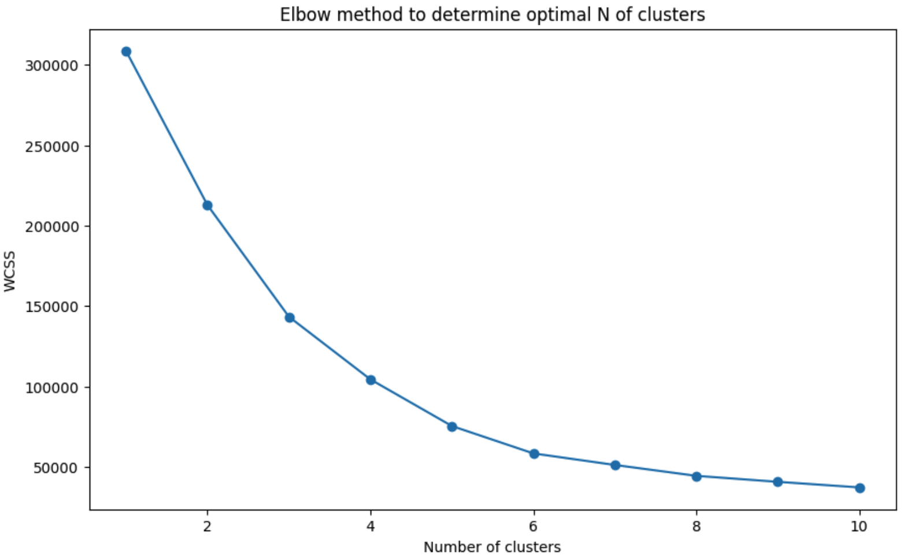
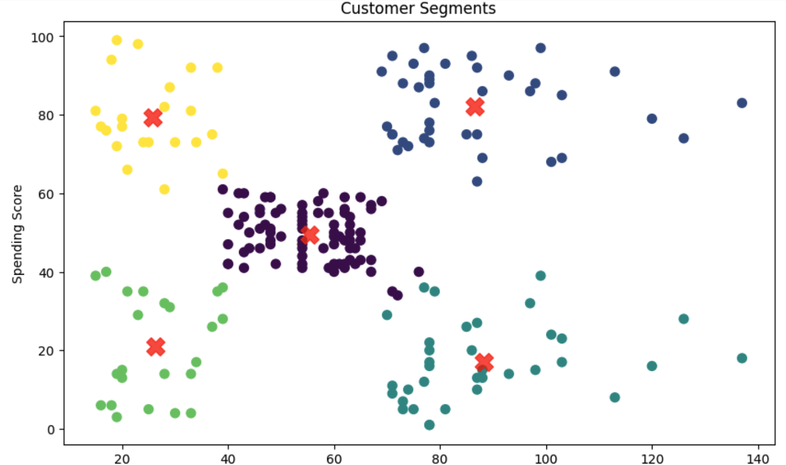
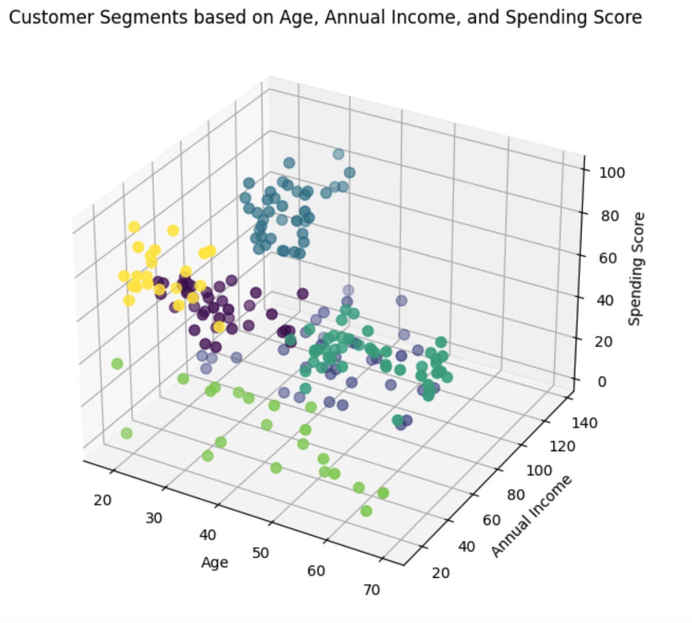

# Data science & ML projects

### K-Means Clustering

 K-Means clustering algorithm applied to a dataset of customer data. The scatter plot displays the distribution of customers based on two features: annual income and spending score. Different clusters are represented with distinct colors, and the cluster centers are highlighted.
 
 
 
